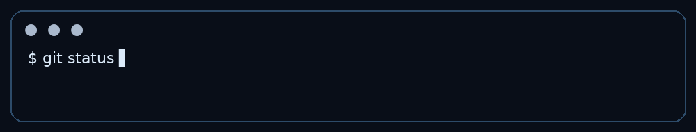
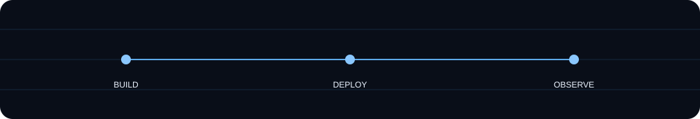

<div align="center">


</div>

# AHMED RADI EL-REFAEI
### Cloud • DevOps • Networking • Automation

Communication & Networks Engineering Student · Expected Graduation 2027

> Building infrastructure, automating systems, and turning architectures into running software.

---

## `01` — ENGINEERING IDENTITY
I work at the intersection of **Cloud Engineering, DevOps, Networking, Infrastructure, and Software**.

`Architecture → Code → Container → Deployment → Operations`

## `02` — TECH STACK
**Cloud & DevOps:** AWS · Docker · Docker Compose · Kubernetes · GitHub Actions · CI/CD · Linux · Terraform · Docker Hub

**Networking:** CCNA · VLANs · STP · EtherChannel · DHCP · IPv4/IPv6 · OSPF · BGP · EIGRP · NAT/PAT · ACL · VPN · Wireless · QoS · Packet Tracer · GNS3

**Development:** C · Python · Java · JavaScript · HTML · CSS · PHP · Node.js · Flask · Spring Boot · MySQL · PostgreSQL · SQL · REST APIs

**Engineering / Data:** MATLAB · Simulink · XGBoost · Random Forest · LightGBM · SMOTE · PCA · Matplotlib

---

## `03` — BUILD → DEPLOY → OBSERVE
<div align="center"></div>

## `04` — FEATURED SYSTEMS

### 🛒 Simple Store — E-Commerce DevOps & Cloud Deployment
**Nginx Frontend → Flask Backend → PostgreSQL**

Dockerized frontend/backend/database, Docker Compose, health and products API verification, Docker Hub publishing, and Kubernetes deployment work.

```text
ecommerce-frontend:1.0
ecommerce-backend:1.0
ecommerce-db:1.0
```

### 🏦 Secure Smart Banking Platform
**Frontend → Spring Boot Backend → H2 / AI Service**

Java 17 · Spring Boot · Maven · H2 · Docker · Git · GitHub. Includes containerization, repository/branch workflows, infrastructure organization, and deployment preparation.

### 🌐 Networking & Cisco Labs
VLANs · Router-on-a-Stick · Layer 3 Switching · STP · EtherChannel · DHCP · IPv6 · OSPF · ACL · NAT/PAT · Wireless · WLC · IoT segmentation

### 📡 OFDM / DMT / 5G Engineering
DMT · OFDM · OFDMA · 5G numerology · Cyclic Prefix · Resource Blocks · PAPR · DFT-s-OFDM · FFT/IFFT · QAM · AWGN · MATLAB/Simulink

---

## `05` — GITHUB ACTIVITY
<div align="center">


<br><br>

</div>

## `06` — CONTRIBUTION MOTION
<div align="center">

</div>

## `07` — ENGINEERING LAB
```text
CLOUD          → AWS / IAM / VPC / EC2 / S3 / CloudWatch
DEVOPS         → Docker / CI/CD / GitHub Actions
ORCHESTRATION  → Kubernetes / Services / Deployments
NETWORKING     → Cisco / Routing / Switching / Wireless
INFRASTRUCTURE → Linux / Terraform / VMware
SOFTWARE       → Python / Java / Node.js / REST
AI / DATA      → ML experiments / XGBoost / PCA
```

## `08` — TRAINING
- CCNA Training
- NTI Cloud Essentials
- Huawei Cloud Essential Developer / HCCDA-related cloud training

## `09` — ROADMAP
`Cloud ████████████████░░░░`  
`DevOps ████████████████░░░░`  
`Kubernetes ██████████████░░░░░░`  
`IaC ███████████░░░░░░░░░`  
`Networking █████████████████░░░`  
`Automation ███████████░░░░░░░░░`

## `10` — CONNECT
<div align="center">
<a href="https://github.com/eng-ahmedradi">GitHub</a> ·
<a href="https://hub.docker.com/u/ahmedradii">Docker Hub</a>
<br><br>

</div>
